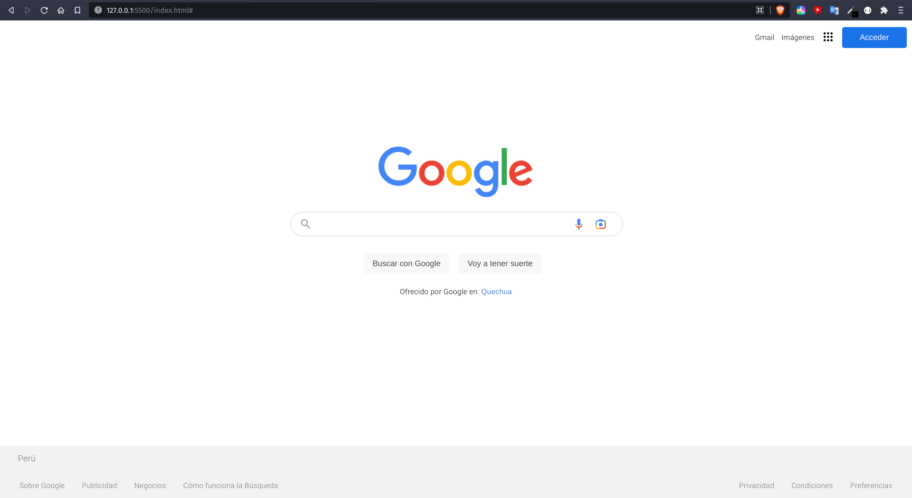

# **Bienvenido a la página clon de Google!**
**Instalación:**

Descargar los archivos del repositorio en la terminal usando el comando:

- *git clone https://github.com/HugoGT/Google-clone.git*

Correr la página abriendo el archivo index.html en el navegador.

El resultado es este:

